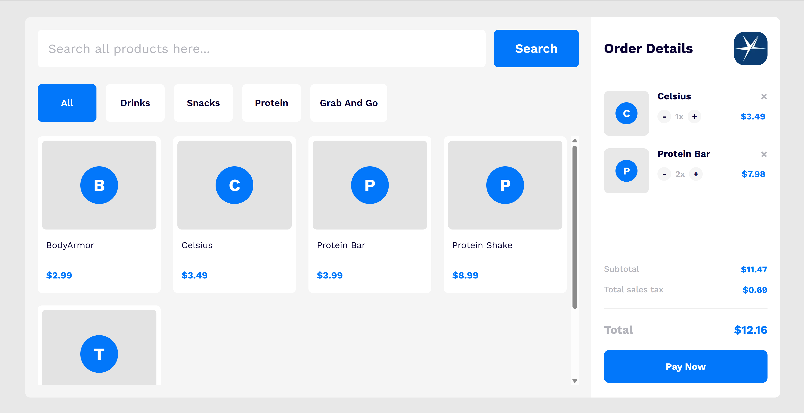
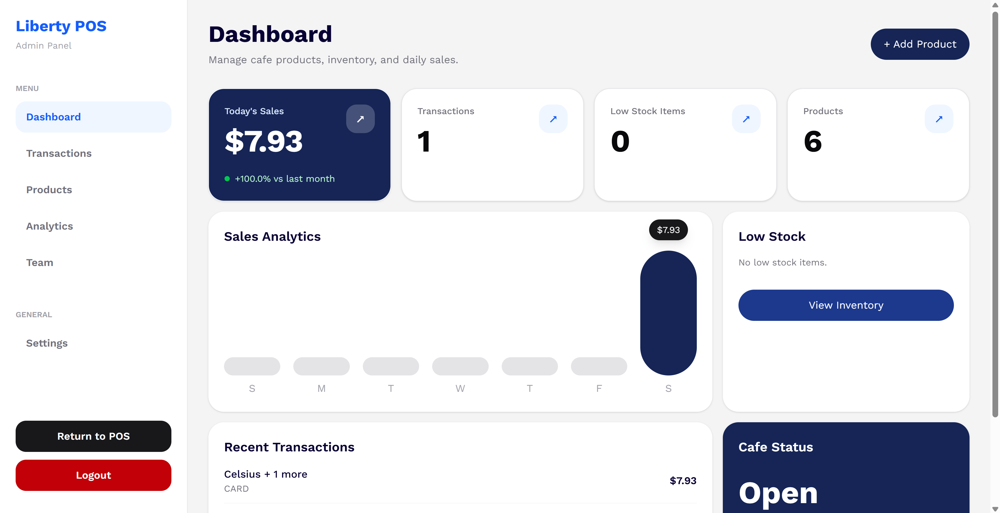
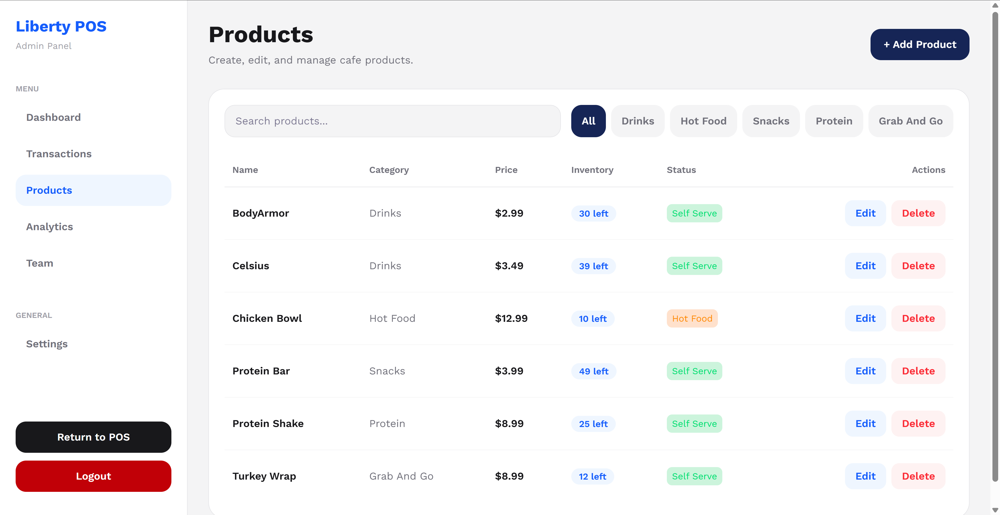
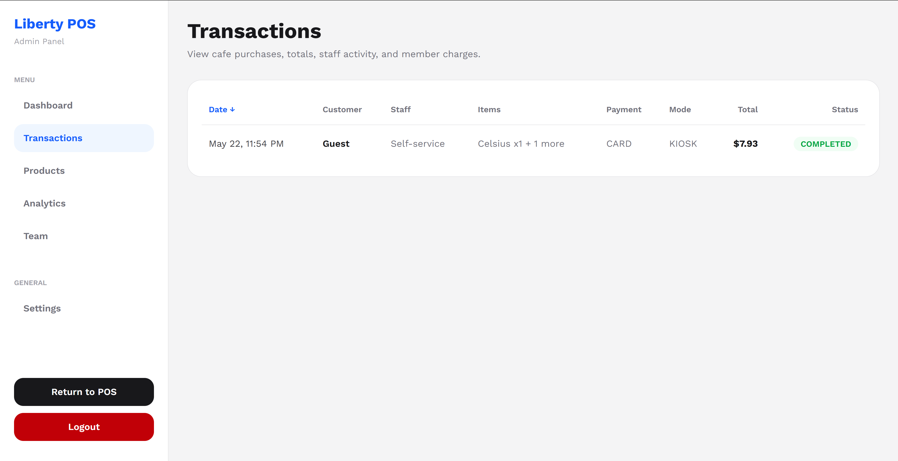
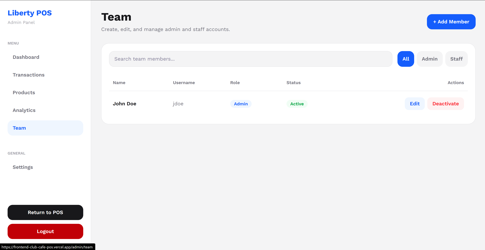

# Liberty POS



A modern full-stack cafe and checkout system inspired by real workflows at Liberty Athletic Club.

Liberty POS is designed to modernize athletic club cafe operations through a clean kiosk experience, staff/admin management tools, inventory tracking, role-based authentication, analytics, and member account charging.

---

# Overview

Liberty POS was built to simulate a production-style point of sale system used inside an athletic club environment.

The project focuses on:

* Modern kiosk UI/UX
* Role-based staff/admin authentication
* Inventory-aware transactions
* Analytics dashboards
* Member charge-to-account workflows
* Full-stack architecture with separated frontend/backend services
* Production deployment using Vercel + Neon PostgreSQL

The system supports multiple user experiences:

* Guest self-service kiosk
* Staff checkout mode
* Admin dashboard and management tools

---

# Tech Stack

## Frontend

* Next.js 16
* React
* TypeScript
* Tailwind CSS
* Clerk Authentication

## Backend

* Node.js
* Express
* TypeScript
* Prisma ORM
* PostgreSQL
* Clerk JWT Authentication

## Infrastructure

* Vercel (Frontend + Backend)
* Neon PostgreSQL
* Clerk

---

# Features

## Kiosk Experience

* Modern self-service ordering interface
* Category filtering
* Dynamic cart system
* Quantity controls
* Responsive layout
* Employee access shortcut

## Authentication & Authorization

* Clerk authentication
* JWT-based backend authorization
* Protected API routes
* Role-based access control
* Admin-only dashboard access

## Admin Dashboard



* Sales analytics
* Product management
* Team management
* Transaction history
* Inventory tracking
* Operational statistics

## Product Management



* Create/edit products
* Enable/disable kiosk visibility
* Inventory count tracking
* Product categorization
* Soft-disable support

## Transactions



* Staff checkout flow
* Kiosk checkout flow
* Charge-to-member-account support
* Historical transaction snapshots
* Tax + subtotal calculations

## Team Management



* Admin/staff role separation
* Team directory
* Role updates
* Staff permissions

---

# Architecture

The application is structured as a separated frontend/backend monorepo.

```txt
club-cafe-pos/
├── frontend/
│   ├── src/
│   ├── app/
│   ├── components/
│   └── lib/
│
├── backend/
│   ├── src/
│   │   ├── controllers/
│   │   ├── middleware/
│   │   ├── routes/
│   │   └── lib/
│   │
│   ├── prisma/
│   └── api/
│
└── README.md
```

---

# Database Design

The system uses PostgreSQL with Prisma ORM.

Core entities include:

* Users
* Products
* Transactions
* Transaction Items
* Settings

Important architectural decisions:

* Historical transaction snapshots preserve product pricing consistency
* Inventory values are stored per product
* Role-based permissions are enforced server-side
* JWT claims are validated in backend middleware

---

# Authentication Flow

Liberty POS uses Clerk for authentication.

## Frontend

* Users authenticate with Clerk
* Frontend retrieves JWT tokens using `getToken()`
* Tokens are attached to protected API requests

## Backend

* Clerk middleware validates incoming JWTs
* Custom middleware protects admin routes
* Role claims are checked server-side

Example protected route:

```ts
router.get(
  "/dashboard",
  requireAuth,
  requireAdmin,
  adminLimiter,
  getAdminDashboard
);
```

---

# Production Deployment

## Frontend

Deployed on Vercel.

Environment variables:

```env
NEXT_PUBLIC_API_URL=...
NEXT_PUBLIC_CLERK_PUBLISHABLE_KEY=...
```

## Backend

Deployed separately on Vercel.

Environment variables:

```env
DATABASE_URL=...
CLERK_SECRET_KEY=...
CLERK_PUBLISHABLE_KEY=...
NODE_ENV=production
```

## Database

Hosted using Neon PostgreSQL.

---

# Running Locally

## Frontend

```bash
cd frontend
npm install
npm run dev
```

## Backend

```bash
cd backend
npm install
npm run dev
```

---

# Future Improvements

Planned production-style improvements include:

* Stripe payment integration
* Real inventory decrement transactions
* Receipt printing
* Kitchen display system
* Mobile ordering
* ClubAutomation integration
* Audit logging
* Advanced analytics
* Sales forecasting
* Offline support
* Barcode scanning
* Multi-location support

---

# Why This Project?

Liberty POS was created to solve real operational inefficiencies observed inside an athletic club cafe environment.

The goal was not only to build a visually modern POS system, but also to practice production-level software engineering concepts including:

* Authentication architecture
* Role-based authorization
* Backend API design
* Relational database modeling
* Full-stack deployment
* State management
* Operational tooling
* Real-world workflow optimization

---

# Author

Ryan Barszcz

* Portfolio: [https://ryanbarszcz.com](https://ryanbarszcz.com)
